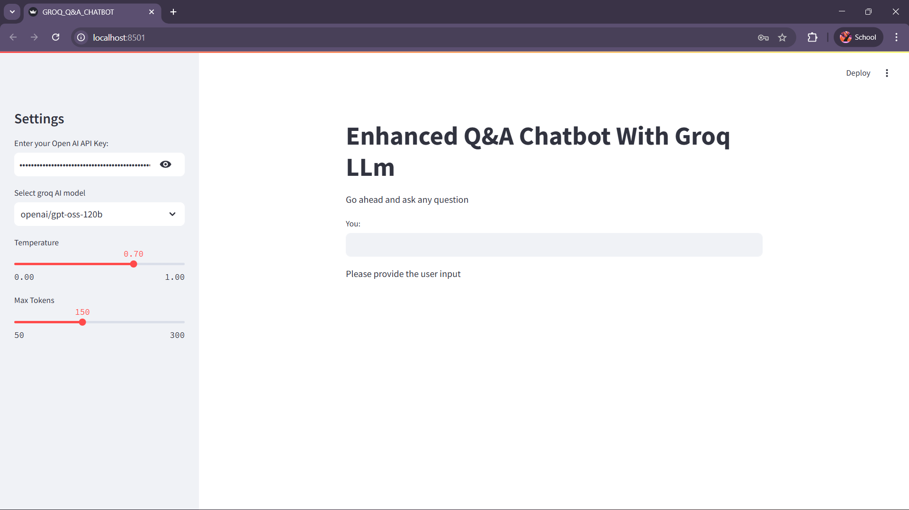
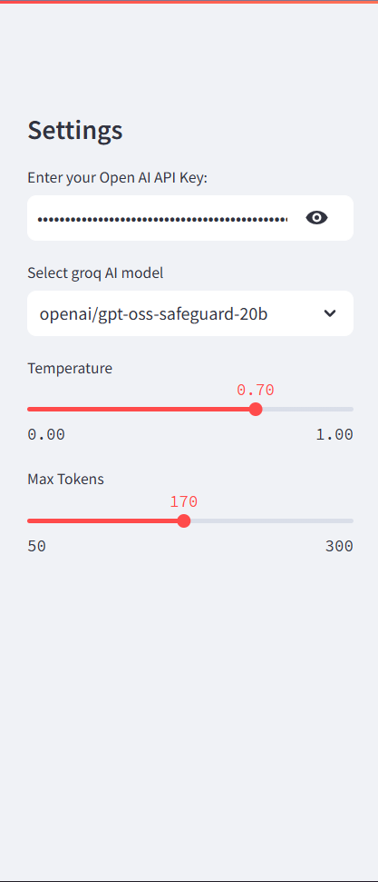
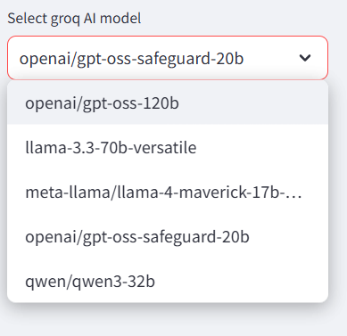
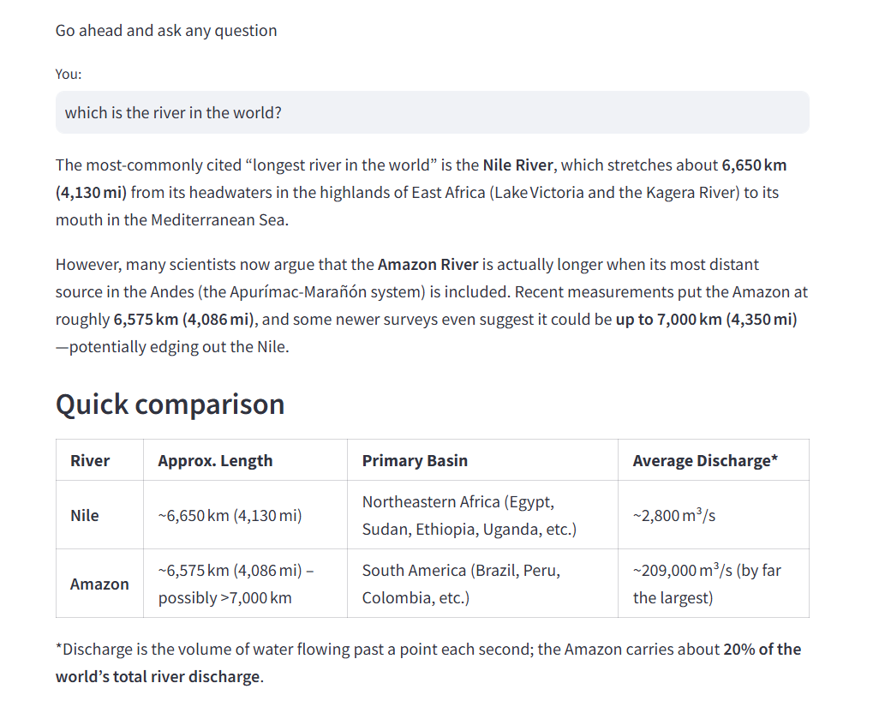

# Enhanced Q&A Chatbot with Groq LLM

An interactive question-answering chatbot powered by Groq's high-performance LLM API and built with Streamlit. This application provides real-time responses to user queries using state-of-the-art language models with customizable parameters.

## Overview

This project is designed for developers, researchers, and enthusiasts who want to build and deploy a simple yet powerful AI chatbot. It leverages Groq's ultra-fast inference capabilities combined with LangChain's orchestration framework to deliver accurate and rapid responses to user questions.

## Features

- Ultra-fast response generation using Groq API
- Multiple AI model options (GPT, Llama, Qwen)
- Customizable temperature and token settings
- LangSmith integration for tracking and monitoring
- Clean and intuitive Streamlit interface
- Secure API key management

## Screenshots

### Main Interface

*The chatbot's main interface showing the title, input area, and clean layout*

### Settings Sidebar

*Comprehensive settings panel with API key input, model selection, temperature, and max tokens controls*

### Model Selection

*Multiple Groq AI models available including GPT, Llama, and Qwen variants*

### Sample Query & Response

*Example query about world rivers with detailed, formatted response including comparison table*

## Installation

### Prerequisites

- Python 3.8 or higher
- pip package manager

### Clone the Repository

```bash
git clone <your-repository-url>
cd groq-qa-chatbot
```

### Install Dependencies

```bash
pip install -r requirements.txt
```

Create a `requirements.txt` file with the following dependencies:

```
streamlit
langchain
langchain-groq
langchain-core
python-dotenv
```

## Environment Variables

Create a `.env` file in the root directory and add the following variables:

```env
GROQ_API_KEY=your_groq_api_key_here
HUGGINGFACEHUB_API_TOKEN=your_huggingface_token_here
LANGCHAIN_API_KEY=your_langchain_api_key_here
```

### How to Obtain API Keys

- **GROQ_API_KEY**: Sign up at [Groq Console](https://console.groq.com/)
- **HUGGINGFACEHUB_API_TOKEN**: Get from [Hugging Face Settings](https://huggingface.co/settings/tokens)
- **LANGCHAIN_API_KEY**: Obtain from [LangSmith](https://smith.langchain.com/)

## Run Locally

1. Ensure all dependencies are installed
2. Set up your `.env` file with required API keys
3. Run the Streamlit application:

```bash
streamlit run app.py
```

4. Open your browser and navigate to `http://localhost:8501`
5. Enter your Groq API key in the sidebar
6. Select your preferred model and adjust parameters
7. Start asking questions!

## API Reference

### Groq Models Available

| Model | Description |
|-------|-------------|
| `openai/gpt-oss-120b` | OpenAI GPT open-source variant |
| `llama-3.3-70b-versatile` | Meta's Llama 3.3 70B model |
| `meta-llama/llama-4-maverick-17b-128e-instruct` | Llama 4 Maverick instruction-tuned |
| `openai/gpt-oss-safeguard-20b` | Safety-focused GPT variant |
| `qwen/qwen3-32b` | Qwen 3 32B model |

### Function: `generate_response()`

## Deployment

### Deploy on Streamlit Cloud

1. Push your code to GitHub
2. Visit [Streamlit Cloud](https://streamlit.io/cloud)
3. Connect your GitHub repository
4. Add environment variables in the Streamlit Cloud dashboard
5. Deploy!

### Deploy on Other Platforms

- **Heroku**: Use `Procfile` and set environment variables
- **AWS/GCP/Azure**: Deploy using container services
- **Docker**: Create a Dockerfile for containerization


## Configuration Parameters

### Temperature (0.0 - 1.0)
- Lower values (0.0-0.3): More focused and deterministic responses
- Medium values (0.4-0.7): Balanced creativity and accuracy
- Higher values (0.8-1.0): More creative and varied responses

### Max Tokens (50 - 300)
Controls the maximum length of the generated response.


## Feedback

We'd love to hear your thoughts and suggestions! Please feel free to:

- Open an issue on GitHub
- Submit a pull request
- Contact us directly via email

Your feedback helps us improve this project!

## Links

- **LinkedIn**: [Your LinkedIn Profile]
- **Email**: your.email@example.com


## Acknowledgments

- [Groq](https://groq.com/) for their lightning-fast LLM API
- [LangChain](https://langchain.com/) for the orchestration framework
- [Streamlit](https://streamlit.io/) for the amazing web framework
- [Hugging Face](https://huggingface.co/) for NLP tools and resources

## Troubleshooting

### Common Issues

**Issue**: "API Key not found"
- **Solution**: Ensure your `.env` file is properly configured and in the root directory

**Issue**: "Model not responding"
- **Solution**: Check your Groq API key validity and rate limits

**Issue**: "Module not found errors"
- **Solution**: Run `pip install -r requirements.txt` again

